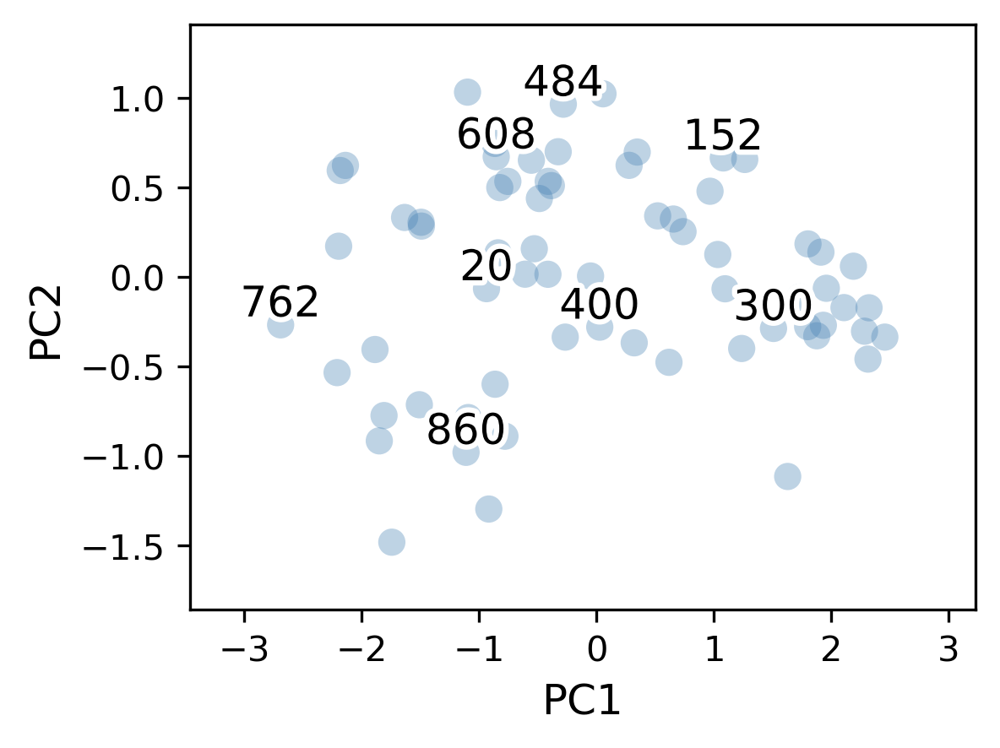

# The Geometry of Governance: Institutional Manifolds

Repository for the paper **"The Geometry of Governance: A Topological Perspective on Institutional Manifolds"** by Adriel I. Santoso.

## Overview

While comparative political science often relies on discrete regime typologies, this project explores the utility of modeling state architecture as a continuous, low-dimensional manifold. Using cross-national data and manifold learning techniques (PCA and UMAP), this repository maps governance coordinates via institutional **Magnitude** (mean capacity) and **Imbalance** (structural skew) across a triad of Order, Liberty, and Equality.

## Visualizing the Manifold

*Figure 1: The continuous manifold of state governance, showing how regime architectures blend across a geometric spectrum.*

### Key Findings
* **The Continuous Manifold:** Nation-states do not form discrete clusters; they exist on a continuous geometric spectrum.
* **The Funnel of State Capacity:** Achieving the highest tiers of state capacity strictly requires dimensional balance.
* **The Imbalance Premium:** Controlling for magnitude, institutional imbalance positively associates with human development (HDI) and economic prosperity, suggesting a *Developmental Vanguard* hypothesis.

## Repository Structure

\`\`\`text
institutional-manifolds/
├── data/               # Place your downloaded datasets here (ignored by git)
├── figures/            # Output folder for generated plots and manifolds
├── paper/              # LaTeX source code for the manuscript
├── src/                # Python scripts for data processing and analysis
├── .gitignore          # Ignored files and directories
├── requirements.txt    # Python dependencies
└── README.md           # Project documentation
\`\`\`

## Data Requirements

To run this analysis, you will need the **World Values Survey (WVS) Wave 7** dataset. Due to size and licensing, it is not included in this repository.

1. Download the `WVS_Cross-National_Wave_7_csv_v6_0.csv` file from the [official WVS website](https://www.worldvaluessurvey.org/).
2. Place the downloaded `.csv` file directly into the `data/` directory.

## Installation & Usage

1. **Clone the repository:**
   \`\`\`bash
   git clone https://github.com/your-username/institutional-manifolds.git
   cd institutional-manifolds
   \`\`\`

2. **Set up a virtual environment (recommended):**
   \`\`\`bash
   python -m venv venv
   source venv/bin/activate  # On Windows use `venv\Scripts\activate`
   \`\`\`

3. **Install the required packages:**
   \`\`\`bash
   pip install -r requirements.txt
   \`\`\`

4. **Run the analysis:**
   Open `src/analysis.ipynb` using your preferred notebook environment (e.g., VS Code, Cursor, JupyterLab, or Google Colab). Running the cells sequentially will impute missing data, calculate the Institutional Triad, perform the PCA/UMAP projections, run the OLS regressions, and save all figures directly to the `figures/` directory.

## Writing & Manuscript

The manuscript is located in the `paper/` directory. 
* To compile the PDF locally, ensure you have a LaTeX distribution (like TeX Live) installed.
* Open `paper/main.tex` in your editor and compile using `latexmk` or the LaTeX Workshop extension.
* Note: Figures are pulled from the `figures/` directory.

## Author

**Adriel I. Santoso** Department of Mechanical and Aerospace Engineering, Tohoku University
